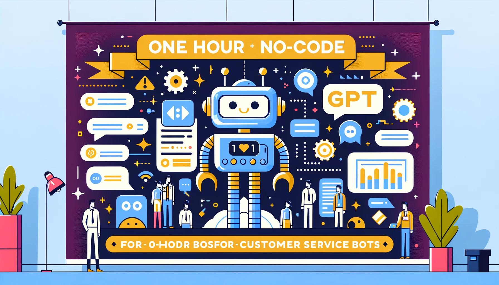

# 一小時 No-Code 自製客服機器人 GPT 學員課前注意事項

## 課程簡介

在本次課程裡，我們要一起輕鬆打造您的第一個機器人小幫手！沒錯，您不需要是程式高手，也能藉助 GPT-4 的強大威力，建造出一個聰明伶俐的客服機器人。只需一小時，您就能學會如何利用 GPT 最新技術，讓這個機器人成為您回答客戶問題、解決困難的好夥伴。課程內容將從數據清洗、Prompt 設計、Logo 設計、外加測試與微調、直到成功上架 GPTs 的完整過程。除此之外，也會介紹常見的提示攻擊與防禦機制，活動中將會 Live Demo 完整過程，並且全程錄影授課內容，提供學員 3 個月內無限次數觀看。

不論您是剛起步的創業者，還是想要為您的團隊減輕負擔的經理人，這門課都非常適合您。我們會帶您從零開始，一步步輕鬆學習，最後讓您能夠自豪地說：「這個機器人，是我自己做的！」準備好迎接您業務的新助力了嗎？趕快來加入這堂課吧！

## 課程特色

* 本課程包含實作練習，確保學員能深刻理解應用方式
* 學員可以在不寫程式的情況下實作出完整客服機器人
* 由 [Will 保哥](https://www.facebook.com/will.fans)全程線上授課，無地域限制，可即時回應學員任何疑惑
* 學員可透過多種管道提問：Zoom 聊天室、Zoom 共享桌面
* 學員可透過共享螢幕的方式提問與遠端控制，學員可觀摩解決問題的過程
* 課程全程錄影，學員課後 3 個月內可免費無限次重播！
* 免費贈送 **GPTs 提示防禦手冊電子書**一本 (學員限定)

## 報名連結

* 2023.11.24 (五) 20:00 - 22:00 [一小時 No-Code 自製客服機器人 GPT (第一梯次)](https://www.accupass.com/go/no-code-gpt) (已額滿)
* 2023.11.27 (一) 20:00 - 22:00 [一小時 No-Code 自製客服機器人 GPT (第二梯次)](https://www.accupass.com/go/no-code-gpt-2) (已額滿)

## 前言

各位同學大家好：

這是一個 100% No-Code (不用寫程式) 的課程，我們會使用 [ChatGPT](https://chat.openai.com/) 最近推出的 [GPTs](https://openai.com/blog/introducing-gpts) 平台，來建立一個客服機器人。因此有一些部分需要學員配合在上課前準備好，以下文件將說明學員上課前的注意事項，請詳細閱讀並提前準備，有任何疑問都歡迎隨時來信洽詢。

## 註冊 OpenAI 帳號

請務必事先註冊號一個 OpenAI 帳號，只要你有用過 [ChatGPT](https://chat.openai.com/) 的話，那麼你已經有帳號了。

## 升級 ChatGPT Plus 帳號

由於本次課程所使用的平台是 ChatGPT 最新推出的 GPTs 或稱 Custom GPT 功能，該功能目前僅限付費用戶使用，因此請務必在上課前升級你的帳號為 ChatGPT Plus 帳號。

如果你最近才打算升級到 ChatGPT Plus 帳號的話，有些人可能會發現無法在 ChatGPT 網站購買升級方案，如下圖示 **Sign up for waitlist** 就是要你先排隊才能購買：

我最近有找到一個方法可以跳過等待程序，直接可以訂閱 ChatGPT Plus 方案。你只要直接點選以下連結，就可以直接訂閱 ChatGPT Plus 方案了：

* <https://chat.openai.com/invite/accepted>

如果上課時都還沒有辦法升級到 ChatGPT Plus 也沒關係，我們的課程可以讓各位在課後無限次數查看 3 個月，因此你可以在課後再來看影片複習。

## 驗證你已經可以使用 GPTs 功能

請先進入 [ChatGPT](https://chat.openai.com/) 網站，然後點選左上角的 **Explore** 按鈕，如果你可以看到 **Create a GPT** 按鈕，那就代表你已經可以使用 GPTs 功能了。

## 上課前注意事項

請注意！由於目前 OpenAI 用戶多達一億人，因此 OpenAI 會限制每個用戶 GPT-4 的使用次數：

由於限制條件經常在改變，以我撰文的時間來說，目前的限制為 3 小時內只能提問 40 條訊息，提問超過 40 條訊息後，就會被鎖定 3 小時，這段時間就無法再使用 GPT-4 或 GPTs。

因此，為了避免上課時無法使用 GPT-4，請各位學員在上課前 3 小時，不要使用 ChatGPT，以免上課的時候無法參與練習的環節。

> 備註: 這是因為 GPTs 的背後就是使用 GPT-4 模型，因此練習設計 GPTs 的過程，也會受到 GPT-4 的使用限制。

## 安裝軟體

我們在練習「資料清理」的環節時，會使用到 Visual Studio Code 編輯器，請各位學員事先安裝好 Visual Studio Code 編輯器，並且安裝幾個推薦的 Visual Studio Code 擴充套件。

* 安裝 [Visual Studio Code](https://code.visualstudio.com/) 編輯器

  由於 Visual Studio Code 是一套跨平台的編輯器，支援 Windows、macOS 與 Linux，因此理論上所有人都可以順利安裝與使用。

  另外，這套 Visual Studio Code 支援完整的「繁體中文」介面，在首次安裝並啟動後，該軟體就會提醒你安裝，建議英文不太好的朋友可以安裝繁體中文版。

  

  如果你的介面沒有自動切換到繁體中文版，那就請透過以下步驟手動切換：

  

  

  

* 安裝 [Markdown Extension Pack](https://marketplace.visualstudio.com/items?itemName=doggy8088.markdown-extension-pack) 與 [盤古之白](https://marketplace.visualstudio.com/items?itemName=doggy8088.pangu2) 擴充套件

  請先按下「延伸模組」按鈕：

  

  然後搜尋 `Markdown Extension Pack` 與 `盤古之白` 這兩個擴充套件，由於重複的套件名稱很多，請認名 `Will 保哥` 出品的版本！⭐

  

  

## 準備好你的問答資料

再強大的 AI 也需要數據支援，你要用自己的知識打造客服機器人，就需要有自己的資料。而資料格式五花八門，什麼都有可能，因此要將資料整理成 AI 看的懂得格式就非常重要，我們課堂上會教大家如何整理這些資料。

為了在課堂上進行深入的練習和交流，我們建議學員提前準備相關資料。這將有助於我們集體探討如何清理數據並將其轉換為 GPT-4 能夠解讀的格式。當然，如果您沒有可用的數據，我們也將在課程中提供範例資料，以便學員能夠實際操作並加深理解。

如果你真的沒有資料可以使用，那麼我們也會在上課時提供一些範例資料讓大家在課堂上練習。

## 上課連結

由於我們上課時會採用 [Zoom](https://zoom.us/zh-tw/download) 軟體進行授課，而**上課的 Zoom 會議室連結**實際上是會透過另外的郵件通知學員，郵件主旨會是：

> 【上課通知】一小時 No-Code 自製客服機器人 GPT

如果你沒有收到通知郵件，請立即[寫信](mailto:training@miniasp.com)與我們聯繫！🔥
